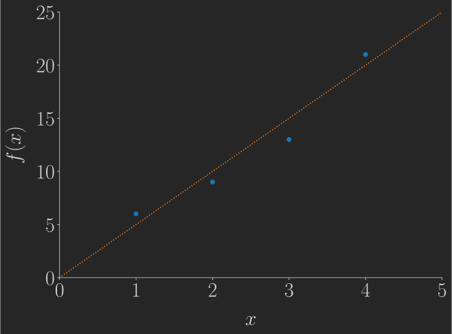

# The *plottingtools* Library
## Preface
This is the documentation to a library of plotting functions which I have been developing for some time now. The library is mostly a collection of wrapper functions around the matplotlib library for Python. Its main purpose is the reduction of boilerplate code required for day-to-day tasks, as well as providing some aesthetically pleasing default parameter choices. Hence, the library is not a plotting library on its own, but a collection of functions intended to make data visualisation (such as for exploratory analysis and the communication of results) just a little bit easier :).

## Quickstart
Just download the plottingtools.py file and paste it either into the folder of your project, or into your Python libraries folder.

Consider the following little Python snippet as an example of how to use it:

```{python3}
import plottingtools as pt

# Activate dark mode and TeX support
pt.darkmode()
pt.texon()

# Make a new plot
fig, ax = pt.singleplot()

# Plot some data
# (Dedicated library functions for this are currently being written, too)
ax.scatter([1,2,3,4], [6,9,13,21])
ax.plot([0,6], [0,30], c="C1", ls=":")

# Set ax limits in one single line of code
pt.limits(ax, (0,5), (0,25))

# Remove top and right spine, again in one single line of code
pt.despine(ax)

# Enlarge the font size of the tick labels (again only one LoC)
pt.ticklabelsize(ax)

# Label axes. Note that TeX syntax is possible, since we activated TeX mode earlier. (yet another one-liner!)
pt.labels(ax, "$x$", "$f(x)$")

# Export figure to file
pt.save_svg("Test.svg")
```

This yields the following figure:



<div style="page-break-after: always;"></div>

## Overview over Features
- Light- and dark mode
- TeX support
- Make single- and multi plot figures with one line of code
- Standard plots
  -  WIP
- Adds some new kinds of useful plots:
  -   Heatmap of similarities of a list of sets
  -   Heatmap of correlations of a list of equal-length vector
  -   Maskes heatmaps (e.g. only show the upper or lower part of a heatmap)
- Easily beautify matplotlib plots using convenience functions with sensible, aesthetically pleasing default choices:
  - Despine plots, change tick positions and labels, change ticklabel size, change axis limits, change tick label rotation, change tick label alignment -- with one single line of code each
  - Add (or change) title, axis labels, rectangles, lines, etc. with one single line of code each
- Export current figure to PNG, SVG or PDF with one single line of code

<div style="page-break-after: always;"></div>

## List of all available commands (without parameters)
### Changing the general Aesthetics
- plottingtools.lightmode()
- plottingtools.darkmode()
- plottingtools.texon()
- plottingtools.texoff()

### Making a new Figure
- plottingtools.singleplot()
- plottingtools.multiplot()

### Standard Plots
- WIP

### Plots unique to plottingtools
- plottingtools.similarity_heatmap()
- plottingtools.correlations_heatmap()
- plottingtools.masked_heatmap()

### Adding elements to an existing plot
- plottingtools.title()
- plottingtools.labels()
- plottingtools.diagonal()
- plottingtools.rectangle()
- plottingtools.star()
- plottingtools.lines()
- plottingtools.grid()
- plottingtools.legend()

### Changing elements of an existing plot
- plottingtools.despine()
- plottingtools.ticklabelsize()
- plottingtools.limits()
- plottingtools.ticks_and_labels()
- plottingtools.rotate_ticklabels()
- plottingtools.align_ticklabels()

### Saving the current figure to a file
- plottingtools.save_png()
- plottingtools.save_svg()
- plottingtools.save_pdf()

### Collections of default parameters for matplotlib plots

- WIP

<div style="page-break-after: always;"></div>

## Changing the general Aesthetics

### **plottingtools.lightmode([foreground = "0", background = "1.0"])**
- Description

    - Switch to light theme.

- Required parameters

    - None.
    
- Optional parameters

    - *foreground* String specifying the foreground colour. Default: "0", i.e. pure black.
    - *background* String specifying the background colour. Default: "1.0", i.e. pure white.

- Return

    - None.

### **plottingtools.darkmode([foreground = "0.85", background = "0.15"])**
- Description

    - Switch to dark theme.

- Required parameters

    - None.
    
- Optional parameters

    - *foreground* String specifying the foreground colour. Default: "0.85", i.e. light grey.
    - *background* String specifying the background colour. Default: "0.15", i.e. dark grey.

- Return

    - None.

### **plottingtools.texon()**
- Description

    - Switch on TeX-rendering of texts and numbers in plots.

- Required parameters

    - None.
    
- Optional parameters

    - None.

- Return

    - None.


### **plottingtools.texoff()**

- Description

    - Switch off TeX-rendering of texts and numbers in plots.

- Required parameters

    - None.
    
- Optional parameters

    - None.

- Return

    - None.


<div style="page-break-after: always;"></div>


## Making a new Figure

### **plottingtools.singleplot([size = (10, 7)])**
- Description

    - Generate a new plot with one figure.

- Required parameters

    - None.
    
- Optional parameters

    - *size* 2-Tuple of numbers, containing the figure's width and height. Default: (10, 7)

- Return
    - 2-tuple (matplotlib.figure.Figure, matplotlib.pyplot.Axes)

### **plottingtools.multiplot(nrows, ncols, size_xy, [wspace, hspace])**
- Description

    - Returns a figure with nrows by ncols subplots

- Required parameters

    - *nrows* integer, the number of rows of plots 
    - *ncols* integer, the number of columns of plots
    - *size_xy* 2-tuple of numbers, containing the figure's width and height
    
- Optional parameters

    - *wspace* Numerical value indicating the width of the padding between subplots, as a fraction of the average Axes width. Alternatively leave at None to not change the default.
    - *hspace* Numerical value indicating the height of the padding between subplots, as a fraction of the average Axes height. Alternatively leave at None to not change the default.

- Return
    - Tuple (matplotlib.figure.Figure, matplotlib.pyplot.Axes)

<div style="page-break-after: always;"></div>

## Standard plots

WIP

<div style="page-break-after: always;"></div>

## Plots unique to plottingtools

### **plottingtools.similarity_heatmap(ax, list_of_lists, method)**

- Description

    - Generate a heatmap, showing the similarity of a list of lists of elements. Note that double entries are not taken into account.

- Required parameters

    - *ax* The matplotlib.pyplot.Axes object where the heatmap will be plotted.
    - *list_of_lists* A list of lists of elements, for which the similarities will be calculated and plotted.
    - *method* Either a string or a function specifying the method for calculating the similarity between the lists. Possible choices:
        - "jaccard": Pairwise Jaccard similarity.
        - A callable function taking two parameters *list1*, *list2*, returning the similarity between *list1* and *list2*.
    
- Optional parameters

    - None.

- Return

    - None.

### **plottingtools.correlations_heatmap(ax, list_of_lists, method)**

- Description

    - Generate a heatmap, showing the correlations of a list of equal-length lists of numerical elements.

- Required parameters

   - *ax* The matplotlib.pyplot.Axes object where the heatmap will be plotted.
    - *list_of_lists* A list of equal-length lists of numerical elements, for which the correlations will be calculated and plotted.
    - *method* Either a string or a function specifying the method for calculating the correlation between the lists. Possible choices:
        - "pearson": Pearson product-moment correlation coefficient.
        - "spearman": Spearman's rank correlation coefficient.
        - "kendall": Kendall rank correlation coefficient.
        - A callable function taking two parameters *list1*, *list2*, returning the desired correlation between *list1* and *list2*.

- Optional parameters

    - None.

- Return

    - None.


### **plottingtools.masked_heatmap(ax, data, mask)**

- Description

    - Plots a 2d heatmap applying a mask, so that only a certain part of the heatmap is actually plotted. Four options are possible: Plotting the lower, upper, lower-diagonal, or upper-diagonal part.

- Required parameters

   - *ax* The matplotlib.pyplot.Axes object where the heatmap will be plotted.
   - *data* A two-dimensional numpy.ndarray containing the data to be plotted.
   - *mask* A string specifying which mask to apply. Possible choices:
       - "upperdiag": Plotting the upper part plus the diagonal elements of the matrix.
       - "upper": Plotting only the upper part of the matrix without the diagonal elements.
       - "lowerdiag": Plotting the lower part plus the diagonal elements of the matrix.
       - "lower": Plotting only the lower part of the matrix without the diagonal elements.
    
- Optional parameters

    - None.

- Return

    - None.

<div style="page-break-after: always;"></div>

## Adding elements to an existing plot
### **plottingtools.title(ax, title, [fontsize = 40, pad = 20])**

- Description

    - Adds or changes a title to/of an existing matplotlib.pyplot.Axes object.

- Required parameters

    - *ax* The matplotlib.pyplot.Axes object.
    - *title* String containing the title.
    
- Optional parameters

    - *fontsize* The font size of the title. Deafults to 40.
    - *pad* The padding between the title and the actual plot. Defaults to 20.

- Return

    - None.

### **plottingtools.labels(ax, xlabel, ylabel, [fontsize = 30, pad = 15])**

- Description

    - Adds ior changes the x and y axis labels of an matplotlib.pyplot.Axes object. To only change one of the labels, pass None to the respective other parameter.

- Required parameters

    - *ax* The matplotlib.pyplot.Axes object.
    - *xlabel* String containing the new x-axis label, or None to leave the x-axis label unchanged.
    - *ylabel* String containing the new y-axis label, or None to leave the y-axis label unchanged.
    
- Optional parameters

    - *fontsize* The font size of the labels. Defaults to 30.
    - *pad* The padding between the axis labels and the axes. Defaults to 15.

- Return

    - None.

### **plottingtools.diagonal(ax, [colour = "black", alpha = 0.3, linestyle = "-", linewidth = 2])**

- Description

    - Add a 1:1 diagonal to an existing matplotlib.pyplot.Axes object.

- Required parameters

    - *ax* The matplotlib.pyplot.Axes object.
    
- Optional parameters

    - *colour* A string specifying the colour of the diagonal. Defaults to "black".
    - *alpha* Numerical value between 0 and 1, specifying the transparency of the diagonal. Defaults to 0.3.
    - *linestyle* String specifying the line style of the diagonal. Defaults to "-", i.e. a continuous line.
    - *linewidth* Numerical value specifying the width of the diagonal. Defaults to 2.

- Return
 
     - None.

### **plottingtools.rectangle(ax, x1, y1, x2, y2, [colour = "red", linewidth = 3, linestyle = "-", fill = False])**

- Description

    - Add a rectangle to an existing matplotlib.pyplot.Axes object.

- Required parameters

    - *ax* The matplotlib.pyplot.Axes object.
    - *x1* x-coordinate of the lower-left point of the rectangle.
    - *y1* y-coordinate of the lower-left point of the rectangle.
    - *x2* x-coordinate of the upper-right point of the rectangle.
    - *y2* y-coordinate of the upper-right point of the rectangle.

- Optional parameters

    - *colour* String specifying the colour of the rectangle's border. Defaults to red.
    - *linewidth* Numerical value specifying the width of the rectangle's border. Defaults to 3.
    - *linestyle* String specifying the line style of the rectangle. Defaults to "-", i.e. a continuous line.
    - *fill* Boolean specifying whether to fill the rectangle. Defaults to False, i.e. no filling.

- Return

    - None.

### **plottingtools.star(ax, x, y, [colour = "red", fontsize = 50])**

- Description

    - Add an asterisk to an existing matplotlib.pyplot.Axes object, e.g. as a marker of statistical significance or to denote special points of interest.

- Required parameters

    - *ax* The matplotlib.pyplot.Axes object.
    - *x* x-coordinate of the asterisk.
    - *y* y-coordinate of the asterisk.
    
- Optional parameters

    - *colour* String specifying the colour of the asterisk. Defaults to red.
    - *fontsize* Numerical value specifying the font size of the star. Defaults to 50.

- Return

    - None.

### **plottingtools.lines(ax, which, pos, [colour = "black", alpha = 0.3, linestyle = "-", linewidth = 2, zorder = -100])**

- Description

    - Add horizontal or vertical lines to an existing matplotlib.pyplot.Axes object.

- Required parameters

    - *ax* The matplotlib.pyplot.Axes object.
    - *which* String specifying whether vertical ("v" or "x")  or horizontal ("h" or "y") lines will be drawn.
    - *pos* List of numerical values specifying the positions of the lines.
    
- Optional parameters
    - *colour* String specifying the line colour. Defaults to "black"
    - *alpha* Numerical value specifying the transparency of the lines. Defaults to 0.3.
    - *linestyle* String specifying the style of the lines. Defaults to "-", i.e. a continuous line.
    - *linewidth* Numerical value specifying the width of the lines. Defaults to 2.
    - *zorder* Numerical value specifying the z-position of the grid lines. Defaults to -100, i.e. very far behind.

- Return

    - None.

### **plottingtools.grid(ax, [which = "major", colour = "black", alpha = 0.1, linestyle = "-", linewidth = 2, zorder = -100])**

- Description

    - Add a grid to an existing matplotlib.pyplot.Axes object.

- Required parameters

    - *ax* The matplotlib.pyplot.Axes object.
    
- Optional parameters
    - *which* String specifying for which ticks ("major", "minor") grid lines will be drawn. Defaults to "major".
    - *colour* String specifying the line colour. Defaults to "black"
    - *alpha* Numerical value specifying the transparency of the lines. Defaults to 0.1.
    - *linestyle* String specifying the style of the lines. Defaults to "-", i.e. a continuous line.
    - *linewidth* Numerical value specifying the width of the lines. Defaults to 2.
    - *zorder* Numerical value specifying the z-position of the lines. Defaults to -100, i.e. very far behind.

- Return

    - None.

### **plottingtools.legend(ax, [loc = "best", fontsize = 25, frame = False, \*\*kwargs])**

- Description

    - Add a legend to an existing matplotlib.pyplot.Axes object.

- Required parameters

    - *ax* The matplotlib.pyplot.Axes object.
    
- Optional parameters
    - *loc* Legend location. Possible are all matplotlib-type location specifiers. Defaults to "best".
    - *fontsize* Number specifying the font size. Defaults to 25.
    - *frame* Boolean specficying whether to draw a frame around the legend. Defaults to False.

- Return

    - None.


<div style="page-break-after: always;"></div>

## Changing elements of an existing plot
### **plottingtools.despine(ax, [which = ['top', 'right']])**

- Description

    - Remove spines of a matplotlib.pyplot.Axes plot.

- Required parameters

    - *ax* The matplotlib.pyplot.Axes object to remove spines from.
    
- Optional parameters

    - *which* Array of strings specifying which spines to remove. Possible choices are "top", "right", "left", "bottom". Defaults to ["top", "right"].

- Return

    - None.

### **plottingtools.ticklabelsize(ax, [which = "both", size = 20])**

- Description

    - Change the size of the tick labels of a matplotlib.pyplot.Axes plot.

- Required parameters

    - *ax* The matplotlib.pyplot.Axes object.
    
- Optional parameters

    - *which* String which denotes the axis of which the tick label size will be changed. Can be "x", "y", or "both" (default).
    - *size* Numerical value with the new font size of the tick labels

- Return
    
    - None.

### **plottingtools.limits(ax, xlimits, ylimits)**

- Description

    - Change the x- and y-axis limits of a matplotlib.pyplot.Axes plot.

- Required parameters

    - *ax* The matplotlib.pyplot.Axes object.
    
- Optional parameters

    - *xlimits* Tuple or list of two numerical values, denoting lower and upper limit of the x-axis. Can also be None, in which case the limits of the x-axis remain unchanged.
    - *ylimits* Tuple or list of two numerical values, denoting lower and upper limit of the y-axis. Can also be None, in which case the limits of the y-axis remain unchanged.

- Return

    - None.

### **plottingtools.ticks_and_labels(ax, which, ticks, labels)**

- Description

    - Set tick positions and labels of an axis of a matplotlib.pyplot.Axes object.

- Required parameters

    - *ax* The matplotlib.pyplot.Axes object.
    - *which* String which denotes the axis of which the tick positions and labesl will be changed. Can be "x", "y", "xy", "yx" or "both".
    - *ticks* List of numerical values specifying the tick positions.
    - *labels* List of strings containing the labels associated with the *ticks*.

    
- Optional parameters

    - None.

- Return

    - None.

### **plottingtools.rotate_ticklabels(ax, which, rotation)**

- Description

    - Set the rotation of the tick labels of an axis of a matplotlib.pyplot.Axes object.

- Required parameters

    - *ax* The matplotlib.pyplot.Axes object.
    - *which* String which denotes the axis of which the tick labels will be rotated. Can be "x", "y", "xy", "yx", or "both".
    - *rotation* Numerical value specifying the new angle of the tick labels.

- Optional parameters

    - None.

- Return

    - None.

### **plottingtools.align_ticklabels(ax, which, horizontal, vertical)**

- Description

    - Set the aligement of the tick labels of an axis of a matplotlib.pyplot.Axes object.

- Required parameters

    - *ax* The matplotlib.pyplot.Axes object.
    - *which* String which denotes the axis of which the tick labels will be aligned. Can be "x", or "y".
    - *horizontal* String specifying the kind of horizontal alignment. Can be "center", "right", or "left".
    - *vertical* String specifying the kind of horizontal alignment. Can be "center", "top", "bottom", or "baseline".
    
- Optional parameters

    - None.

- Return

    - None.

<div style="page-break-after: always;"></div>

## Saving the current figure to a file
### **plottingtools.save_png(filename, [dpi = 300])**

- Description

    - Save the current plot as PNG file.

- Required parameters

    - *filename* string with the file name to export to.
    
- Optional parameters

    - *dpi* The resolution, in dpi. Default: 300

- Return
    - None.

### **plottingtools.save_svg(filename)**

- Description

    - Save the current plot as SVG file.

- Required parameters

    - *filename* string with the file name to export to.
    
- Optional parameters

    - None

- Return
    - None.


### **plottingtools.save_pdf(filename)**

- Description

    - Save the current plot as PDF file.

- Required parameters

    - *filename* string with the file name to export to.
    
- Optional parameters

    - None.

- Return
    - None.

<div style="page-break-after: always;"></div>

## Collections of default parameters for matplotlib plots (documentation of this section is WIP)


 
